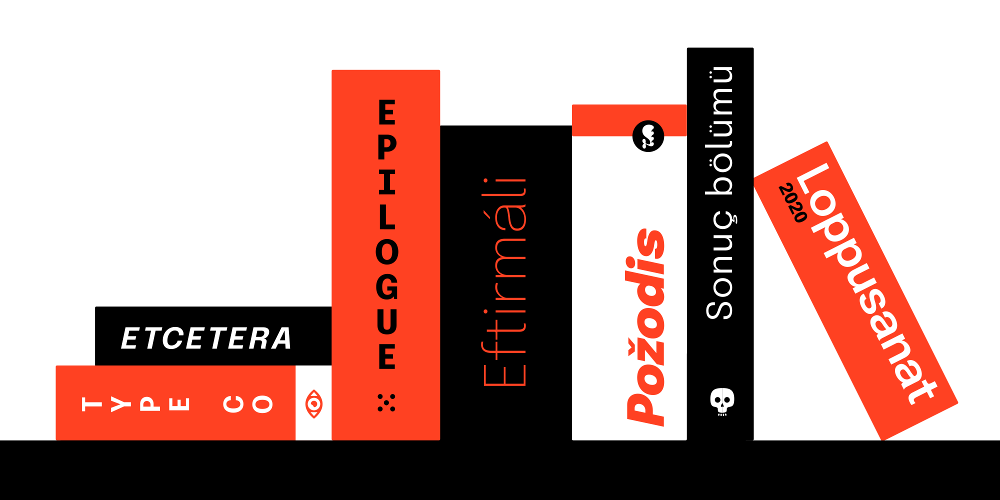
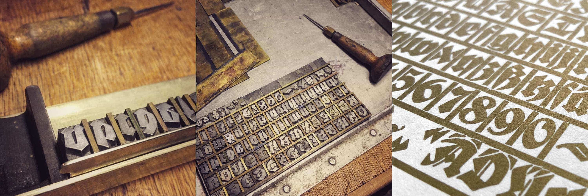
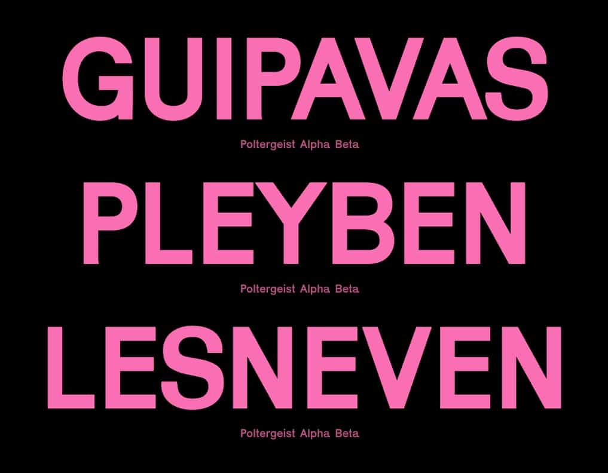
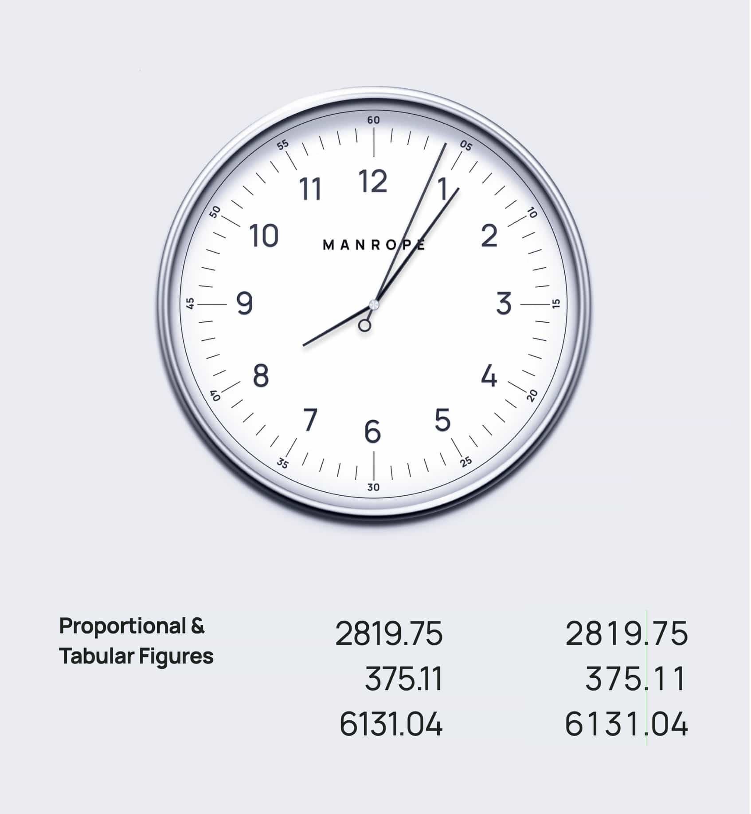
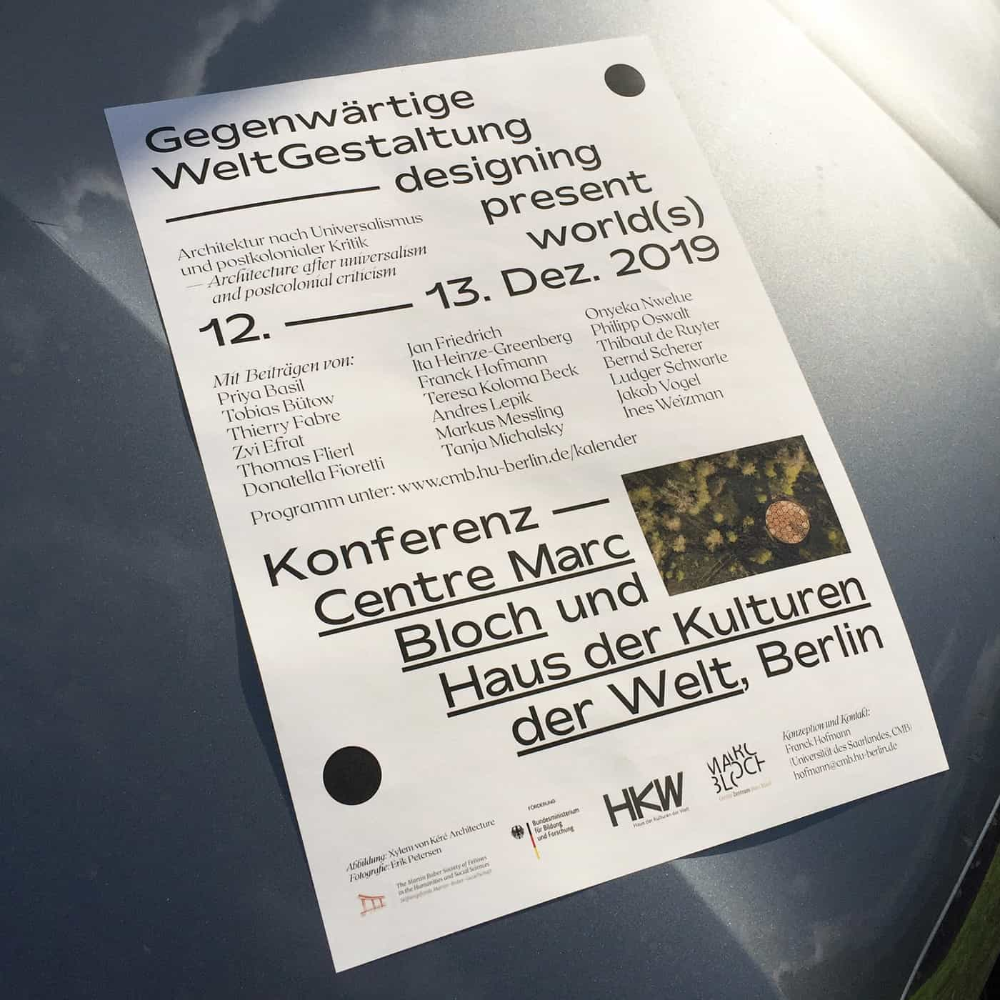
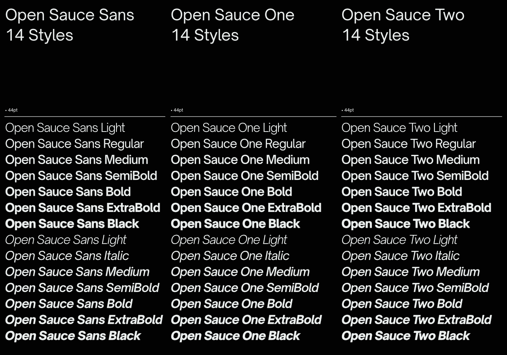
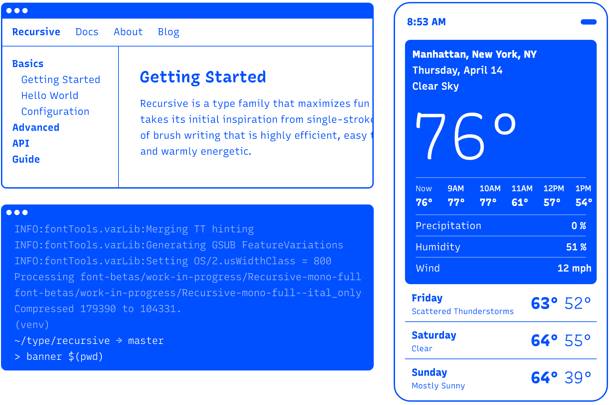
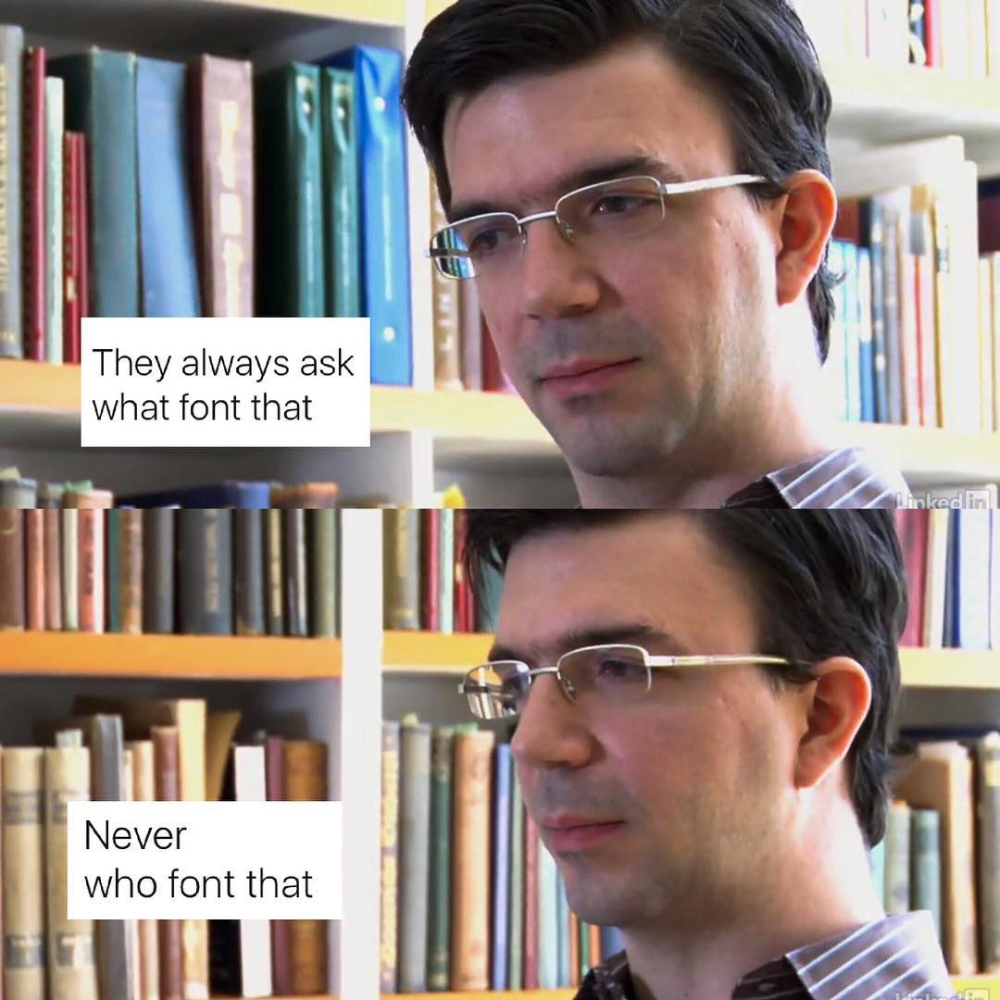

# 📓 Awesome OSS Fonts

A collection of quality open-source fonts.

## Fonts

### Sans-serif

| Font               | Subgenre  | Designer                                      | Released | Updated  | Notes                                 |                           Link                            |
| :----------------- | :-------- | :-------------------------------------------- | :------- | :------- | :------------------------------------ | :-------------------------------------------------------: |
| Barlow             | Grotesque | Jeremy Tribby                                 | Oct 2017 | Jun 2020 | inspired by California road signage   |          [GitHub](https://github.com/jpt/barlow)          |
| Chivo              | Grotesque | Héctor Gatti, Omnibus                         | Nov 2011 | Mar 2020 |                                       | [GitHub](https://github.com/Omnibus-Type/Chivo)           |
| DM Sans            | Geometric | Colophon, MultiAdaptor, DeepMind              | Apr 2020 | Apr 2020 | improved version of Poppins           | [GitHub](https://github.com/googlefonts/dm-fonts)         |
| Epilogue           | Grotesque | Tyler Finck, Rosa Wagner                      | Jan 2020 | Jun 2020 | multi-language support                |                    [Website][epilogue]                    |
| IBM Plex Sans      | Grotesque | Mike Abbink, IBM                              | Dec 2018 | Dec 2019 | multi-language support                |                    [GitHub][plex-sans]                    |
| Hauora Sans        | Hybrid    | Wayne Shih                                    | Jul 2018 | Sep 2020 | derivative of Manrope                 |     [GitHub](https://github.com/WCYS-Co/Hauora-Sans)      |
| Instrument Sans    | Hybrid    | Rodrigo Fuenzalida                            | Mar 2023 | Mar 2023 | variable font, wide glyphset          |  [GitHub](https://github.com/Instrument/instrument-sans)  |
| Inter              | Grotesque | Rasmus Andersson                              | Aug 2017 | Nov 2023 | multi-language support                |         [GitHub](https://github.com/rsms/inter/)          |
| Jakarta Sans       | Hybrid    | Gumpita Rahayu                                | Feb 2020 | Feb 2020 | alternate glyphs                      |   [GitHub](https://github.com/tokotype/PlusJakartaSans)   |
| Karrik             | Grotesque | Jean-Baptiste Morizot                         | Jun 2020 | Jun 2020 |                                       |                     [Website][karrik]                     |
| Manrope            | Hybrid    | Mikhail Sharanda                              | Jan 2020 | Dec 2021 | variable font, multi-language support |                    [Website][manrope]                     |
| Mattone            | Humanist  | Nunzio Mazzaferro                             | Feb 2019 | Feb 2019 | highly-readable                       |                    [Website][mattone]                     |
| Open Sauce Sans    | Grotesque | Alfredo Marco Pradil                          | Apr 2020 | Apr 2020 | ink traps                             |                 [GitHub][open-sauce-sans]                 |
| Overpass           | Grotesque | Delve Withrington, Dave Bailey, Thomas Jockin | Aug 2015 | Nov 2019 | inspired by Highway Gothic            |   [GitHub](https://github.com/RedHatOfficial/Overpass)    |
| Reglo              | Geometric | Sebastien Sanfilippo                          | Aug 2009 |          | DIN-inspired                          |       [Website](http://osp.kitchen/foundry/reglo/)        |
| Public Sans        | Grotesque | Dan O. Williams, U.S. Web Standards           | Jan 2020 | Jan 2020 | Franklin clone                        |      [GitHub](https://github.com/uswds/public-sans)       |
| Space Grotesk      | Geometric | Florian Karsten                               | Jan 2018 | Dec 2019 | variable font                         | [GitHub](https://github.com/floriankarsten/space-grotesk) |
| Spartan            | Geometric | Matt Bailey                                   | Feb 2018 | Feb 2020 |                                       | [Google Fonts](https://fonts.google.com/specimen/Spartan) |
| Sporting Grotesque | Grotesque | Lucas Le Bihan                                | Jan 2016 | Apr 2018 | Greek support                         | [Website](http://velvetyne.fr/fonts/sporting-grotesque/)  |
| Violet Sans        | Geometric |                                               | Dec 2019 | Jan 2020 | Eurostile-inspired                    |   [GitHub](https://github.com/violetoffice/violet_sans)   |

### Serif

| Font           | Subgenre     | Designer         | Released | Updated  | Notes                     |                      Link                       |
| :------------- | :----------- | :--------------- | :------- | :------- | :------------------------ | :---------------------------------------------: |
| Gelasio        | Transitional | Eben Sorkin      | Dec 2019 | Dec 2019 | metrics compat w/ Georgia | [GitHub](https://github.com/SorkinType/Gelasio) |
| IBM Plex Serif | Transitional | Mike Abbink, IBM | Dec 2018 | Dec 2019 | multi-language support    |      [GitHub](https://github.com/IBM/plex)      |
| Minipax        | Transitional | Raphaël Ronot    | Mar 2019 | Mar 2019 | alternate glyphs          |  [GitHub](https://github.com/ronotypo/Minipax)  |
| Moretus        | Transitional | Eli Heuer        | Nov 2016 | May 2017 | Plantin revival           | [GitHub](https://github.com/davelab6/libre-moretus) |

### Monospace

| Font           | Subgenre   | Designer                                                                     | Released | Updated  | Notes                                |                              Link                               |
| :------------- | :--------- | :--------------------------------------------------------------------------- | :------- | :------- | :----------------------------------- | :-------------------------------------------------------------: |
| Compagnon      | Slab-serif | Chloé Lozano, Juliette Duhé, Léa Pradine, Sébastien Riollier, Valentin Papon | Oct 2018 | Oct 2018 | super family                         |         [Website](http://velvetyne.fr/fonts/compagnon/)         |
| Courier Prime  | Slab-serif | Alan Dague-Greene                                                            | Jan 2020 | Jan 2020 | Courier revival                      | [Google Fonts](https://fonts.google.com/specimen/Courier+Prime) |
| IBM Plex Mono  | Grotesque  | Mike Abbink, IBM                                                             | Dec 2018 | Dec 2019 | multi-language support               |              [GitHub](https://github.com/IBM/plex)              |
| JetBrains Mono | Geometric  | Philipp Nurullin                                                             | Jan 2020 | Jan 2020 | code ligatures                       |      [GitHub](https://github.com/JetBrains/JetBrainsMono)       |
| Recursive      | Grotesque  | Stephen Nixon                                                                | Aug 2019 | Nov 2021 | variable font, sign painter-inspired |                      [Website][recursive]                       |

### Blackletter

| Font          | Subgenre | Designer                   | Released | Updated | Notes                                        |                                  Link                                   |
| :------------ | :------- | :------------------------- | :------- | :------ | :------------------------------------------- | :---------------------------------------------------------------------: |
| FDI Wiking    |          | Heinz König, Ralf Herrmann | 2020     | 2020    | Recut of historic 1925 typeface of same name |                          [Website][fdi-wiking]                          |
| Grenze Gotish | Fraktur  | Omnibus Type               | 2020     | 2020    |                                              | [Google Fonts](https://fonts.google.com/specimen/Grenze+Gotisch#glyphs) |

## Specimens

#### [Epilogue][epilogue]

#### [FDI Wiking][fdi-wiking]

#### [Karrik][karrik]

#### [Manrope][manrope]

#### [Mattone][mattone] (via [Fonts in Use](https://fontsinuse.com/typefaces/108836/mattone))

#### [Open Sauce Sans][open-sauce-sans]

#### [Recursive][recursive]

## Info

### Project goal

The goal of this project is to **showcase the best _open-source_ typefaces on the internet** (keyword: _open source_; not merely _free_) rather than trying to be a comprehensive catalog of everything. This will be dripping with my own opinions (and I’m quite picky). But hopefully it’s at least a consistent taste. If you’ve found just one typeface you loved from this project, it was worth it.

A secondary goal of this project is to **give credit to the type designers.** Sometimes this isn’t as prominent as it should be on other sites. Give people credit (after all, it’s usually their only form of payment here)!

### Similar projects

If you’d like to discover other typeface collections such as these, check out:

- [Beautiful Web Type](https://beautifulwebtype.com/)
- [chriscoyier/coding-fonts](https://github.com/chriscoyier/coding-fonts)
- [Fontsource](https://github.com/fontsource/fontsource)

_Note: I’m not associated with any of the following_

### How did you find all these typefaces?

Various sources and newsletters, including Twitter. But most of the submissions were found from [Typewolf’s newsletter][typewolf]. You should subscribe (not affiliated; just a fan)!

[karrik]: http://karrik.phantom-foundry.com/
[epilogue]: https://www.etceteratype.co/epilogue
[fdi-wiking]: https://fdi-type.de/fonts/fdi-wiking/
[manrope]: https://manropefont.com/
[mattone]: https://www.fontsquirrel.com/fonts/mattone
[open-sauce-sans]: https://github.com/marcologous/Open-Sauce-Sans
[plex-sans]: https://github.com/IBM/plex
[recursive]: https://recursive.design
[typewolf]: https://www.typewolf.com/newsletter
